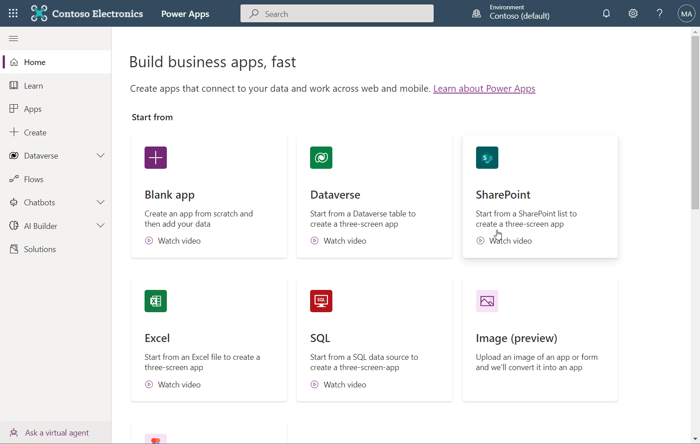

# Create an App
An app consist of one or more screens. 

:::info
You can make one or multi screen applications, selecting multi screen application comes with the cost of e.g. having to consider what need to be shared across screen, e.g. navigation.
:::

We typically suggest to make "One screen" apps for the main flow and supporting screens for settings etc.

## Open PowerApps Designer
Navigate to https://make.powerapps.com/ (You might be asked to sign in) Eventually you will end up in a screen looking like this

## Create a Blank App

## Save it

# Other inspiration

https://carldesouza.com/powerapps-part1-create-app-scratch/