# Connect the List to your App

Head back to your PowerApps 

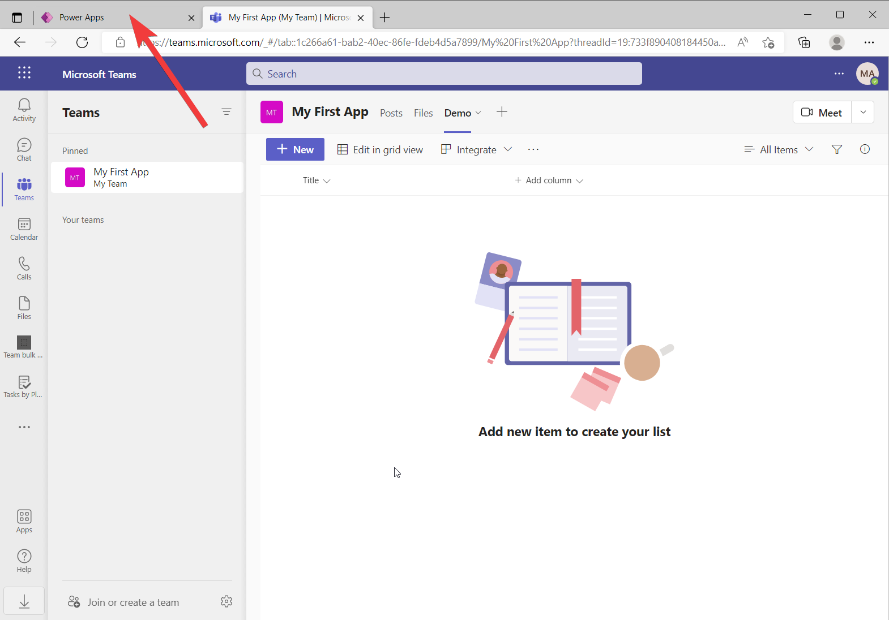

In my case I opened Teams in a new browser tab, so all I have to do is to select the first tab 

## Open the "Data" panel 
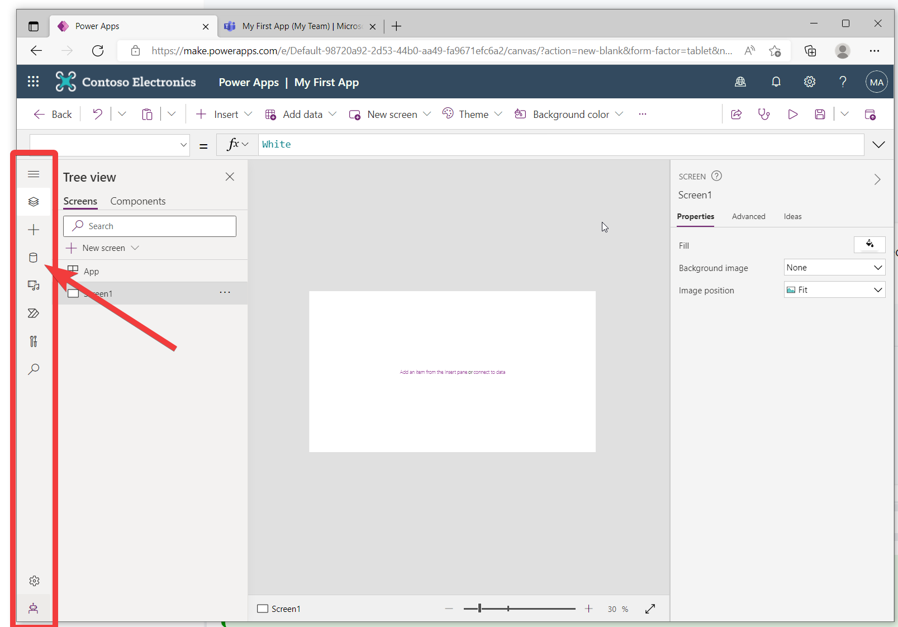
Within the left rail (marked by the surrounding read box), select the database icon 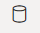

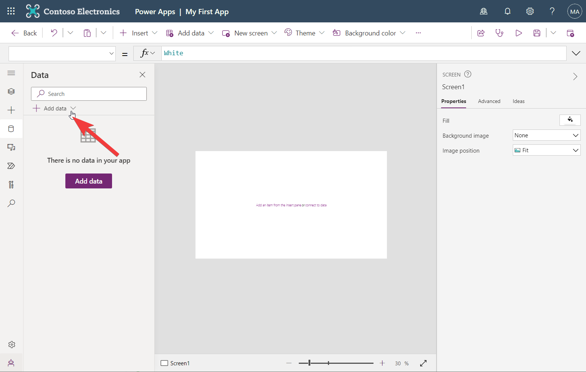

Select Add data 

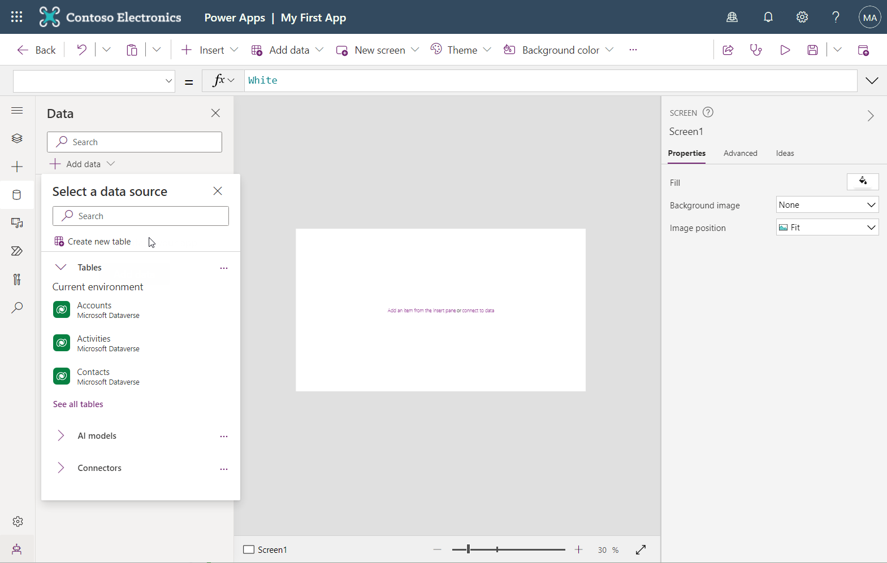

## Connect a SharePoint list
Then type in **sharepoint** 

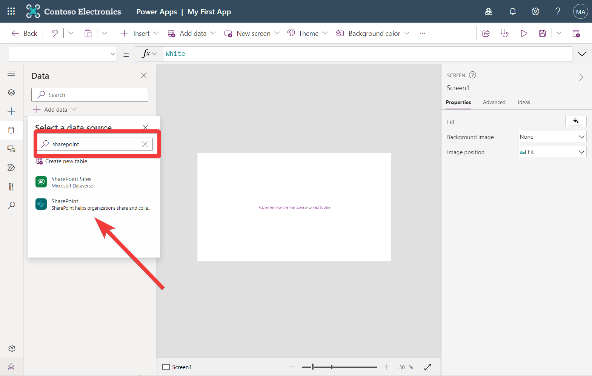

Select the "SharePoint"  

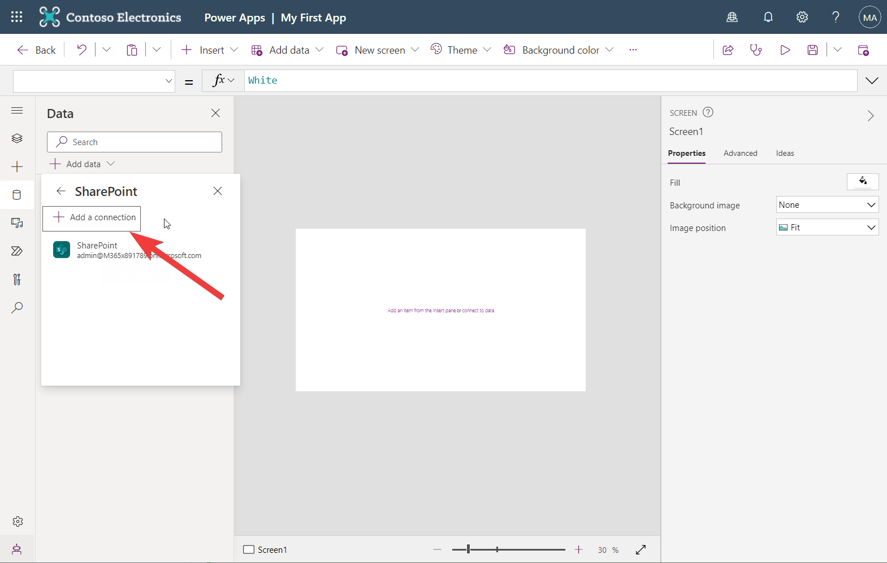

Click Add a connection 

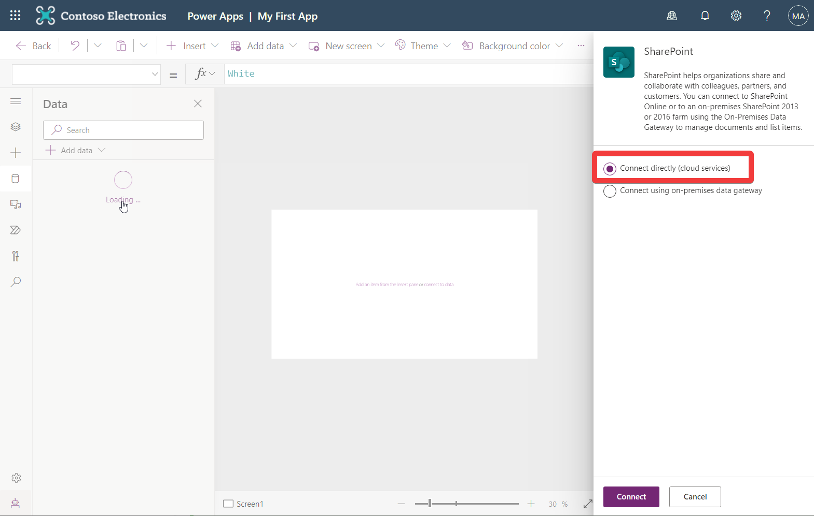

Select **Connect directly (cloud service)**

:::info
Here is becomes tricky. Once you are presented with the **Connect to SharePoint site** panel, you have 2 options. You can either enter the SharePoint URL or select amongst Recent sites.  The later is super handy, but as the list of recent sites have a build in delay, it will not capture if you just have created a list (which is stored in a site, a site which is created automatically when you create a Microsoft Team) 

In this case I have cheated and waited a day for the list to get updated with the Teams that I created earlier, if you haven't got that patience, check 
[Pro tip: How to find the SharePoint URL](../../pro-tips/connectors/sharepoint/how-to-find-the-SharePoint-URL/index.md)
:::
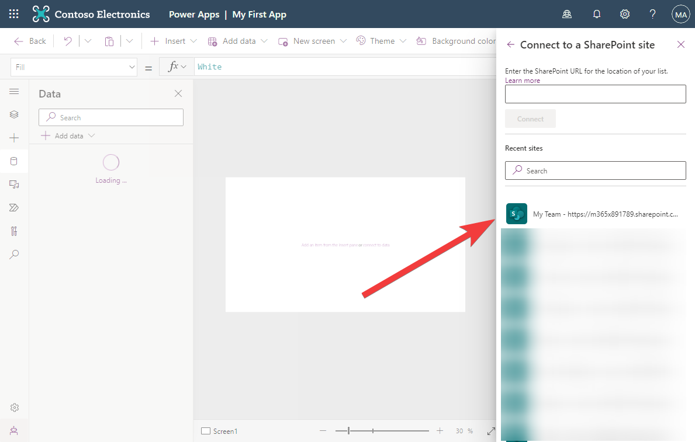

Select **My Team ..."**

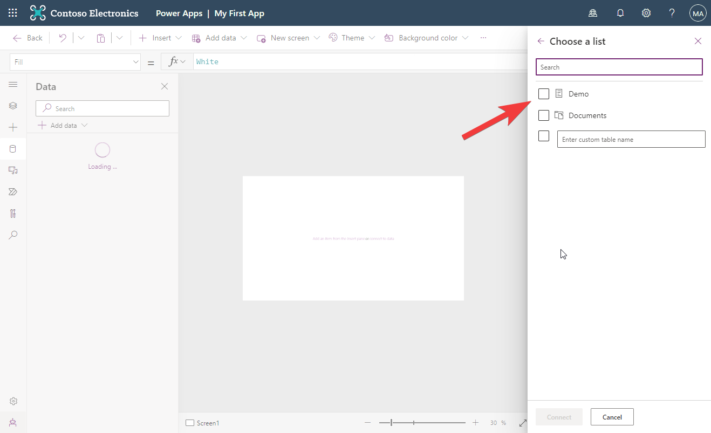

Then select **Demo**
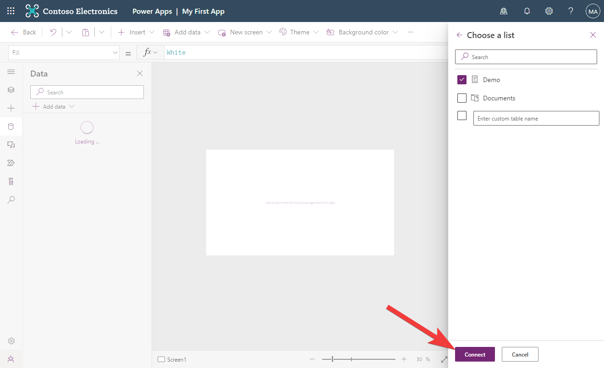

Click **Connect**
## Verify Connections
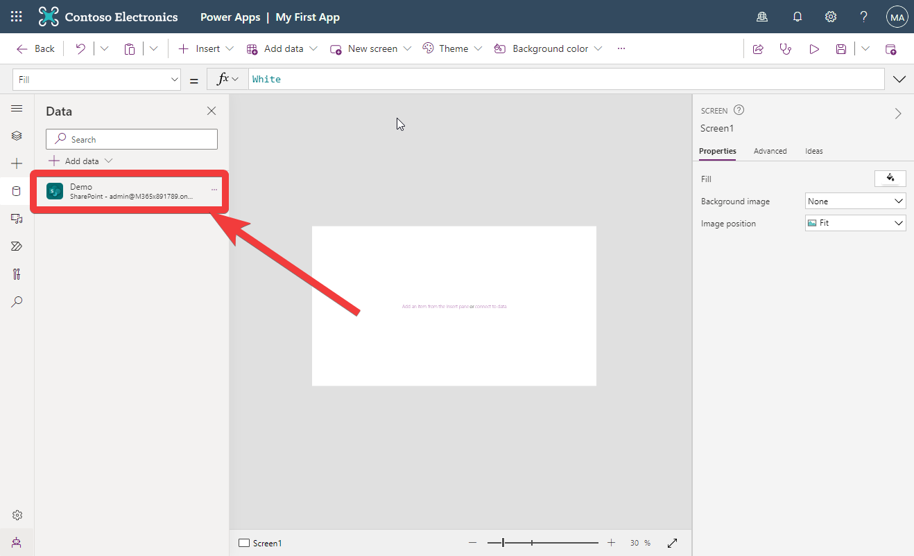

Verify that  shows in the Data panel