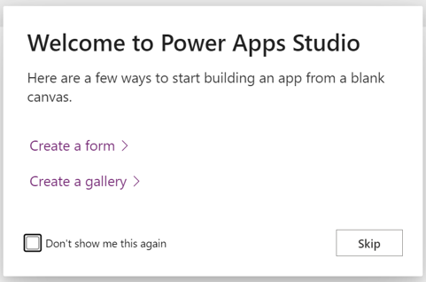
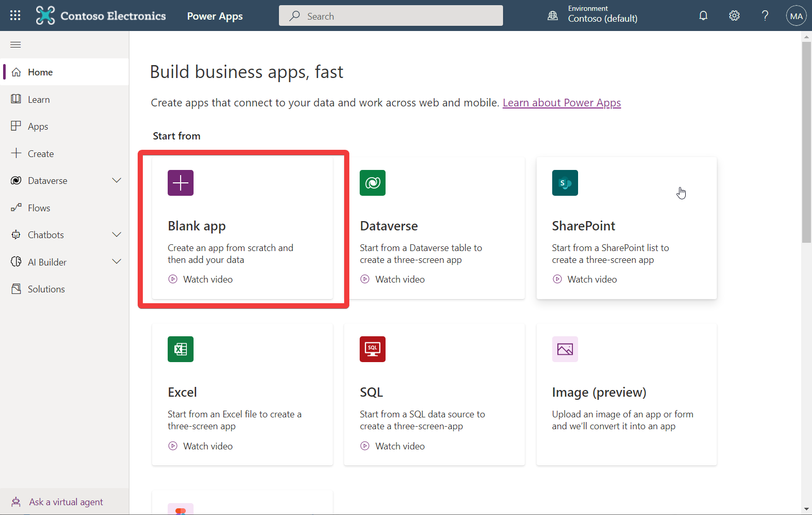
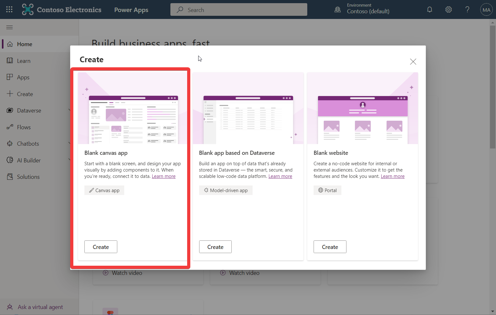
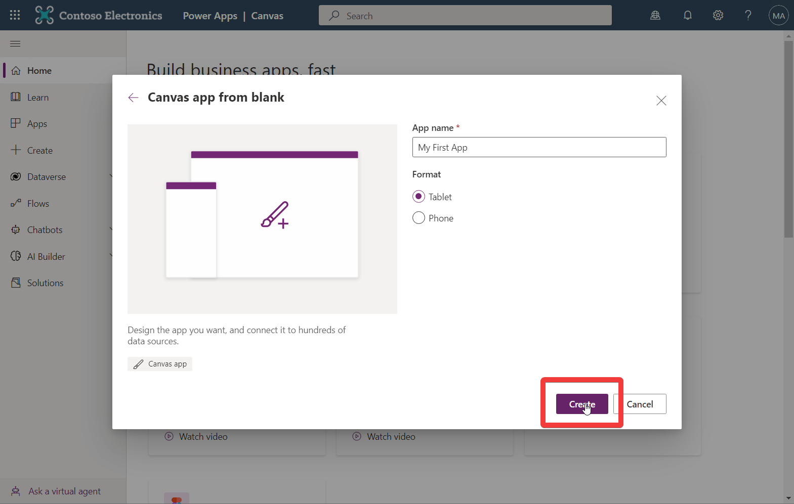
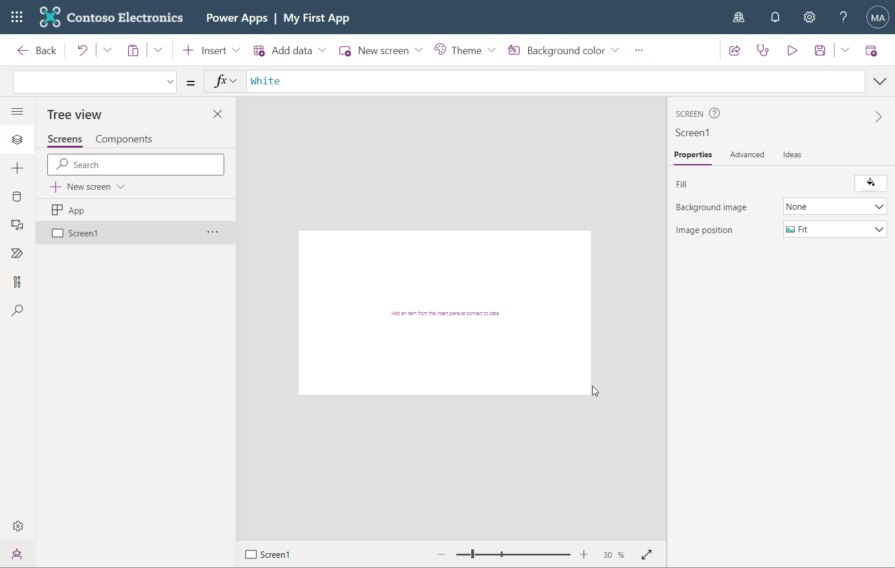

# Create an App
An app consist of one or more screens. 

:::info
You can make one or multi screen applications, selecting multi screen application comes with the cost of e.g. having to consider what need to be shared across screen, e.g. navigation.
:::

We typically suggest to make "One screen" apps for the main flow and supporting screens for settings etc.

## Open PowerApps Designer
Navigate to https://make.powerapps.com/ (You might be asked to sign in) Eventually you will end up in a screen looking like this

## Create a Blank App

Select **"Blank app"**

:::warning
Selecting "Blank app based on Dataverse" or "Blank website" require yuo (and your users) to have additional licenses 
:::

Select **"Blank canvas app"**
## Name the app

The name will need to be unique and will be displayed in the top bar of Office 365 .

Then click **Create**

## Save the App
Hit **Ctrl+S** to save your app.

:::info
PowerApps will automatically get saved every 2 minutes once you have made an initial save.
:::

