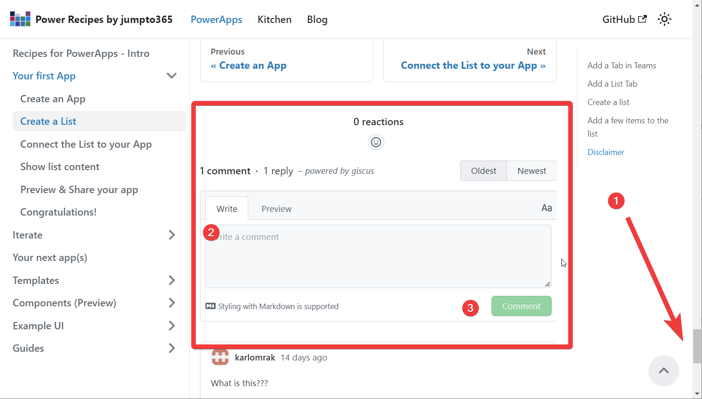
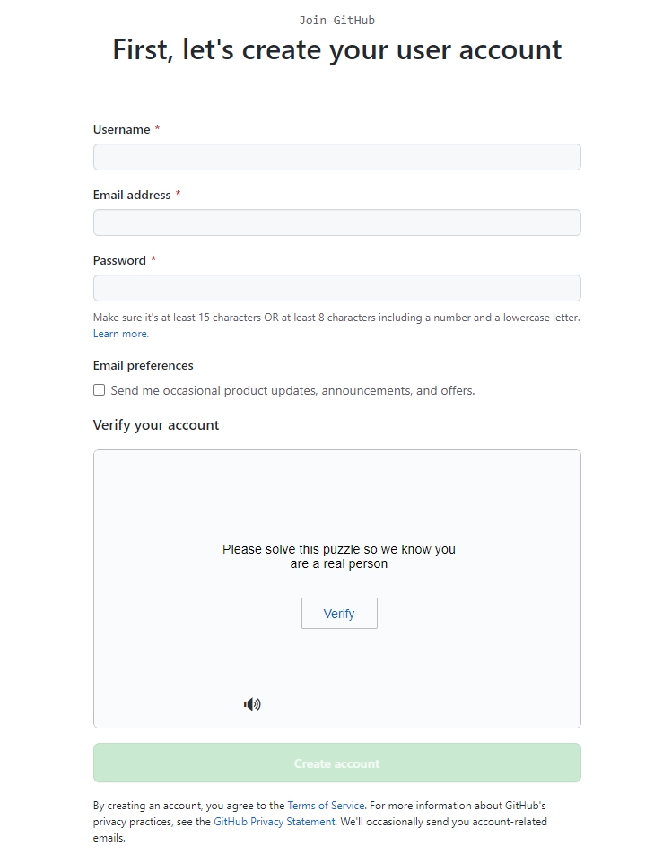

# Q&A 

## How do I give you feedback?
### Q: Something is unclear to me, how do I give you feedback?
### A: Use the feedback button at the bottom of the page to send us your comments and suggestions.

## Comment field greyed out
### Q: The feedback is field is disabled ?
### A: You need to Sign in with GitHub to enabled the comment field.

## What is GitHub?
### Q: Sign in with GitHub, what is that?
### A: GitHub is a platform for developers to collaborate on code. 

You can read more about GitHub here: [Link to more information about GitHub](https://www.w3schools.com/whatis/whatis_github.asp) 

## How to I get a GitHub account?
### Q: I don't have a GitHub account, how do I get one?
### A: You can create a GitHub account here: 

[Link to GitHub sign up](https://github.com/join) 

For user name figure something that is easy to remember and that you can use across different platforms. The Email address can be your work email address or a personal email address. Password should be a strong password, you can use a password manager to generate a strong password.

:::info Enable two-factor authentication
We suggest that you enable two-factor authentication on your GitHub account. This will make it harder for someone to access your account. You can read more about two-factor authentication here: [Link to more information about two-factor authentication](https://docs.github.com/en/authentication/securing-your-account-with-two-factor-authentication-2fa/about-two-factor-authentication)

:::