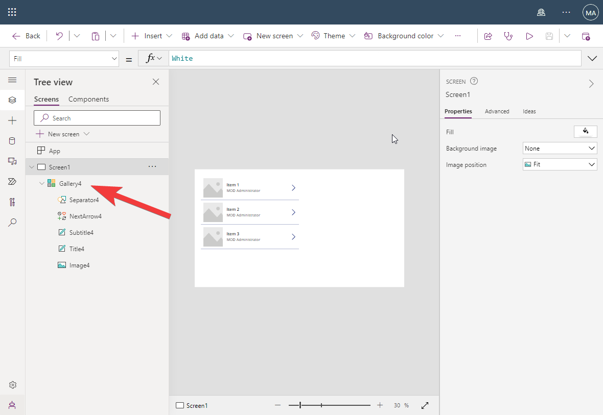
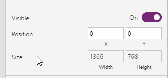

# Responsive PowerApps

:::info [Create responsive layouts in canvas apps (Microsoft Docs)](https://learn.microsoft.com/en-us/power-apps/maker/canvas-apps/create-responsive-layout)
Before you build a canvas app in Power Apps, you specify whether to tailor the app for a phone or a tablet. This choice determines the size and shape of the canvas on which you'll build your app.

After you make that choice, you can make a few more choices if you select Settings > Display. You can choose portrait or landscape orientation and screen size (tablet only). You can also lock or unlock the aspect ratio and support device rotation (or not).

Those choices underlie every other choice you make as you design screen layouts. If your app runs on a device of a different size or on the web, your entire layout scales to fit the screen where the app is running. If an app designed for a phone runs in a large browser window, for example, the app scales to compensate and looks oversized for its space. The app can't take advantage of the additional pixels by showing more controls or more content.

If you create a responsive layout, controls can respond to different devices or window sizes, making various experiences feel more natural. To achieve responsive layout, you adjust some settings and write expressions throughout your app.
:::

## Make the Gallery adjust to current width

Select the "Tree view" panel 

Select **"Gallery4"**  

Check out the **"Properties"** panel, the part with Position and Size. 

Set X to 0, Y to 0, then width to Parent.Width and height to Parent.Height

## Validate position and size of Gallery

Notice that the value of Width and Height is greyed out. The reason for that is that the values are controlled by a formula.

Notice that the Gallery now perfectly matches the size of the Canvas

:::warning
If you manually changes any of the position, height or width properties by using the handles, the property values will loose their dynamic behavior. 
:::

## Compare Responsive vs None Responsive
Hit **F5** which make the [Preview mode](https://learn.microsoft.com/en-us/power-apps/maker/canvas-apps/keyboard-shortcuts#preview) become active.

Try changing the width of the app, and notice that the control, e.g. the **next arrow** keeps it position to the right.

Try turning the **Scale to fit** is On again and repeat the process of changing the width

 

Notice that all elements are proportional scale, but this introduces and unused area on the canvas depending on how you scale.