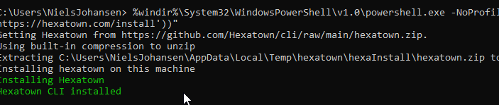

# Get started
Hexatown is an experimental project which I have been working on now and then. I had the idea of coming up with a Command Line Interface (a CLI) which would make my life simpler when acting as a mentor for student worker and young graduates.


I actually managed to make what I consider at powerfull CLI out of that, with an installation technique heavily inspired by chocolatey

As of today (October 2022) I haven't touch it in a the last 12-15 months as a reorganization reduced the number of students to zero. But still see a value in it. Project is hosted at [GitHub](https://github.com/Hexatown/cli)

## Installation


```text title="Copy this, hit <Windows>+<R> and paste it and hit <Enter> "
 %windir%\System32\WindowsPowerShell\v1.0\powershell.exe -NoProfile -ExecutionPolicy unrestricted -Command "[System.Net.ServicePointManager]::SecurityProtocol = 3072;iex ((new-object net.webclient).DownloadString('https://hexatown.com/install'))"
```
What happens is that a PowerShell file found using (https://hexatown.com/install) is downloaded and executed on your machine. See [appendix](#appendix)

See [file structure](files.md)




The hexatown directory is added to the environments **path** variable, making the command files discoverable. So to start hexatown type hexa in a PowerShell console

```powershell title="In Terminal / PowerShell console"
hexa
```


## Appendix

### Installation script downloader
```powershell
# =====================================================================
# Copyright 2017 - 2020 Chocolatey Software, Inc, and the
# original authors/contributors from ChocolateyGallery
# Copyright 2011 - 2017 RealDimensions Software, LLC, and the
# original authors/contributors from ChocolateyGallery
# at https://github.com/chocolatey/chocolatey.org
#
# Licensed under the Apache License, Version 2.0 (the "License");
# you may not use this file except in compliance with the License.
# You may obtain a copy of the License at
#
#   http://www.apache.org/licenses/LICENSE-2.0
#
# Unless required by applicable law or agreed to in writing, software
# distributed under the License is distributed on an "AS IS" BASIS,
# WITHOUT WARRANTIES OR CONDITIONS OF ANY KIND, either express or implied.
# See the License for the specific language governing permissions and
# limitations under the License.
# =====================================================================


# Environment Variables, specified as $env:NAME in PowerShell.exe and %NAME% in cmd.exe.
# For explicit proxy, please set $env:hexatownProxyLocation and optionally $env:hexatownProxyUser and $env:hexatownProxyPassword
# For an explicit version of Hexatown, please set $env:hexatownVersion = 'versionnumber'
# To target a different url for hexatown.nupkg, please set $env:hexatownDownloadUrl = 'full url to nupkg file'
# NOTE: $env:hexatownDownloadUrl does not work with $env:hexatownVersion.
# To use built-in compression instead of 7zip (requires additional download), please set $env:hexatownUseWindowsCompression = 'true'
# To bypass the use of any proxy, please set $env:hexatownIgnoreProxy = 'true'

#specifically use the API to get the latest version (below)
$url = ''

<# TODO
$hexatownVersion = $env:hexatownVersion
if (![string]::IsNullOrEmpty($hexatownVersion)){
  Write-Output "Downloading specific version of Hexatown: $hexatownVersion"
  $url = "https://hexatown.com/api/v2/package/hexatown/$hexatownVersion"
}
#>

$hexatownDownloadUrl = $env:hexatownDownloadUrl
if (![string]::IsNullOrEmpty($hexatownDownloadUrl)){
  Write-Output "Downloading Hexatown from : $hexatownDownloadUrl"
  $url = "$hexatownDownloadUrl"
}

if ($env:TEMP -eq $null) {
  $env:TEMP = Join-Path $env:SystemDrive 'temp'
}

$chocTempDir = join-path ( [System.IO.Path]::GetTempPath()) "hexatown"

$tempDir = Join-Path $chocTempDir "hexaInstall"
if (![System.IO.Directory]::Exists($tempDir)) {[void][System.IO.Directory]::CreateDirectory($tempDir)}
$file = Join-Path $tempDir "hexatown.zip"

# PowerShell v2/3 caches the output stream. Then it throws errors due
# to the FileStream not being what is expected. Fixes "The OS handle's
# position is not what FileStream expected. Do not use a handle
# simultaneously in one FileStream and in Win32 code or another
# FileStream."
function Fix-PowerShellOutputRedirectionBug {
  $poshMajorVerion = $PSVersionTable.PSVersion.Major

  if ($poshMajorVerion -lt 4) {
    try{
      # http://www.leeholmes.com/blog/2008/07/30/workaround-the-os-handles-position-is-not-what-filestream-expected/ plus comments
      $bindingFlags = [Reflection.BindingFlags] "Instance,NonPublic,GetField"
      $objectRef = $host.GetType().GetField("externalHostRef", $bindingFlags).GetValue($host)
      $bindingFlags = [Reflection.BindingFlags] "Instance,NonPublic,GetProperty"
      $consoleHost = $objectRef.GetType().GetProperty("Value", $bindingFlags).GetValue($objectRef, @())
      [void] $consoleHost.GetType().GetProperty("IsStandardOutputRedirected", $bindingFlags).GetValue($consoleHost, @())
      $bindingFlags = [Reflection.BindingFlags] "Instance,NonPublic,GetField"
      $field = $consoleHost.GetType().GetField("standardOutputWriter", $bindingFlags)
      $field.SetValue($consoleHost, [Console]::Out)
      [void] $consoleHost.GetType().GetProperty("IsStandardErrorRedirected", $bindingFlags).GetValue($consoleHost, @())
      $field2 = $consoleHost.GetType().GetField("standardErrorWriter", $bindingFlags)
      $field2.SetValue($consoleHost, [Console]::Error)
    } catch {
      Write-Output "Unable to apply redirection fix."
    }
  }
}

Fix-PowerShellOutputRedirectionBug

# Attempt to set highest encryption available for SecurityProtocol.
# PowerShell will not set this by default (until maybe .NET 4.6.x). This
# will typically produce a message for PowerShell v2 (just an info
# message though)
try {
  # Set TLS 1.2 (3072) as that is the minimum required by hexatown.com.
  # Use integers because the enumeration value for TLS 1.2 won't exist
  # in .NET 4.0, even though they are addressable if .NET 4.5+ is
  # installed (.NET 4.5 is an in-place upgrade).
  [System.Net.ServicePointManager]::SecurityProtocol = [System.Net.ServicePointManager]::SecurityProtocol -bor 3072
} catch {
  Write-Output 'Unable to set PowerShell to use TLS 1.2. This is required for contacting Hexatown as of 03 FEB 2020. https://hexatown.com/blog/remove-support-for-old-tls-versions. If you see underlying connection closed or trust errors, you may need to do one or more of the following: (1) upgrade to .NET Framework 4.5+ and PowerShell v3+, (2) Call [System.Net.ServicePointManager]::SecurityProtocol = 3072; in PowerShell prior to attempting installation, (3) specify internal Hexatown package location (set $env:hexatownDownloadUrl prior to install or host the package internally), (4) use the Download + PowerShell method of install. See https://hexatown.com/docs/installation for all install options.'
}

function Get-Downloader {
param (
  [string]$url
 )

  $downloader = new-object System.Net.WebClient

  $defaultCreds = [System.Net.CredentialCache]::DefaultCredentials
  if ($defaultCreds -ne $null) {
    $downloader.Credentials = $defaultCreds
  }

  $ignoreProxy = $env:hexatownIgnoreProxy
  if ($ignoreProxy -ne $null -and $ignoreProxy -eq 'true') {
    Write-Debug "Explicitly bypassing proxy due to user environment variable"
    $downloader.Proxy = [System.Net.GlobalProxySelection]::GetEmptyWebProxy()
  } else {
    # check if a proxy is required
    $explicitProxy = $env:hexatownProxyLocation
    $explicitProxyUser = $env:hexatownProxyUser
    $explicitProxyPassword = $env:hexatownProxyPassword
    if ($explicitProxy -ne $null -and $explicitProxy -ne '') {
      # explicit proxy
      $proxy = New-Object System.Net.WebProxy($explicitProxy, $true)
      if ($explicitProxyPassword -ne $null -and $explicitProxyPassword -ne '') {
        $passwd = ConvertTo-SecureString $explicitProxyPassword -AsPlainText -Force
        $proxy.Credentials = New-Object System.Management.Automation.PSCredential ($explicitProxyUser, $passwd)
      }

      Write-Debug "Using explicit proxy server '$explicitProxy'."
      $downloader.Proxy = $proxy

    } elseif (!$downloader.Proxy.IsBypassed($url)) {
      # system proxy (pass through)
      $creds = $defaultCreds
      if ($creds -eq $null) {
        Write-Debug "Default credentials were null. Attempting backup method"
        $cred = get-credential
        $creds = $cred.GetNetworkCredential();
      }

      $proxyaddress = $downloader.Proxy.GetProxy($url).Authority
      Write-Debug "Using system proxy server '$proxyaddress'."
      $proxy = New-Object System.Net.WebProxy($proxyaddress)
      $proxy.Credentials = $creds
      $downloader.Proxy = $proxy
    }
  }

  return $downloader
}

function Download-String {
param (
  [string]$url
 )
  $downloader = Get-Downloader $url

  return $downloader.DownloadString($url)
}

function Download-File {
param (
  [string]$url,
  [string]$file
 )
  #Write-Output "Downloading $url to $file"
  $downloader = Get-Downloader $url

  $downloader.DownloadFile($url, $file)
}

$url = "https://github.com/Hexatown/cli/raw/main/hexatown.zip"

# Download the Hexatown package
Write-Output "Getting Hexatown from $url."
Download-File $url $file

# Determine unzipping method
# 7zip is the most compatible so use it by default
$7zaExe = Join-Path $tempDir '7za.exe'
$unzipMethod = '7zip' # 
## > inserted
$unzipMethod = '' 
$useWindowsCompression = 'true' # $env:hexatownUseWindowsCompression
## < inserted
if ($useWindowsCompression -ne $null -and $useWindowsCompression -eq 'true') {
  Write-Output 'Using built-in compression to unzip'
  $unzipMethod = 'builtin'
} elseif (-Not (Test-Path ($7zaExe))) {
  Write-Output "Downloading 7-Zip commandline tool prior to extraction."
  # download 7zip
  Download-File 'https://hexatown.com/7za.exe' "$7zaExe"
}

# unzip the package
Write-Output "Extracting $file to $tempDir..."
if ($unzipMethod -eq '7zip') {
  $params = "x -o`"$tempDir`" -bd -y `"$file`""
  # use more robust Process as compared to Start-Process -Wait (which doesn't
  # wait for the process to finish in PowerShell v3)
  $process = New-Object System.Diagnostics.Process
  $process.StartInfo = New-Object System.Diagnostics.ProcessStartInfo($7zaExe, $params)
  $process.StartInfo.RedirectStandardOutput = $true
  $process.StartInfo.UseShellExecute = $false
  $process.StartInfo.WindowStyle = [System.Diagnostics.ProcessWindowStyle]::Hidden
  $process.Start() | Out-Null
  $process.BeginOutputReadLine()
  $process.WaitForExit()
  $exitCode = $process.ExitCode
  $process.Dispose()

  $errorMessage = "Unable to unzip package using 7zip. Perhaps try setting `$env:hexatownUseWindowsCompression = 'true' and call install again. Error:"
  switch ($exitCode) {
    0 { break }
    1 { throw "$errorMessage Some files could not be extracted" }
    2 { throw "$errorMessage 7-Zip encountered a fatal error while extracting the files" }
    7 { throw "$errorMessage 7-Zip command line error" }
    8 { throw "$errorMessage 7-Zip out of memory" }
    255 { throw "$errorMessage Extraction cancelled by the user" }
    default { throw "$errorMessage 7-Zip signalled an unknown error (code $exitCode)" }
  }
} else {
  if ($PSVersionTable.PSVersion.Major -lt 5) {
    try {
      $shellApplication = new-object -com shell.application
      $zipPackage = $shellApplication.NameSpace($file)
      $destinationFolder = $shellApplication.NameSpace($tempDir)
      $destinationFolder.CopyHere($zipPackage.Items(),0x10)
    } catch {
      throw "Unable to unzip package using built-in compression. Set `$env:hexatownUseWindowsCompression = 'false' and call install again to use 7zip to unzip. Error: `n $_"
    }
  } else {
    Expand-Archive -Path "$file" -DestinationPath "$tempDir" -Force
  }
}

# Call hexatown install
Write-Output "Installing hexatown on this machine"

#TODO Hide in prod
# Invoke-Expression "explorer $tempDir"


$hexaInstallPS1 = Join-Path $tempDir "hexatownInstall.ps1"

& $hexaInstallPS1

```

### Installation script version 

```powershell title="hexatowninstall.ps1"

Write-Host "Installing Hexatown " -ForegroundColor Green

$environmentPath = ([System.Environment]::GetFolderPath([System.Environment+SpecialFolder]::CommonApplicationData)) 

$appdir = $environmentPath + "\hexatown.com"
$destdir = $environmentPath + "\hexatown.com\.hexatown"


if (!(Test-Path $appdir)) {
    New-Item -ItemType Directory -Force -Path $appdir | Out-Null
}

if (!(Test-Path $destdir)) {
    New-Item -ItemType Directory -Force -Path $destdir | Out-Null
}

$path = [Environment]::GetEnvironmentVariable("path","User")

if (!$path.Contains($destdir)){
    [Environment]::SetEnvironmentVariable("path","$path; $destdir","User")
}

Set-ExecutionPolicy -ExecutionPolicy Unrestricted -Scope CurrentUser -Force:$true

Copy-Item "$PSScriptRoot\hexatown.ps1" -Destination $destdir -Force
Copy-Item "$PSScriptRoot\h.ps1" -Destination $destdir -Force
Copy-Item "$PSScriptRoot\x.ps1" -Destination $destdir -Force
Copy-Item "$PSScriptRoot\t.ps1" -Destination $destdir -Force
Copy-Item "$PSScriptRoot\hx.ps1" -Destination $destdir -Force
Copy-Item "$PSScriptRoot\xt.ps1" -Destination $destdir -Force
Copy-Item "$PSScriptRoot\hxt.ps1" -Destination $destdir -Force
Copy-Item "$PSScriptRoot\hexa.ps1" -Destination $destdir -Force
Copy-Item "$PSScriptRoot\hexatree.ps1" -Destination $destdir -Force
Copy-Item "$PSScriptRoot\InstallPackage.ps1" -Destination $destdir -Force
Copy-Item "$PSScriptRoot\hexatown.cmd" -Destination $destdir -Force
Copy-Item "$PSScriptRoot\package.json" -Destination $destdir -Force
Copy-Item "$PSScriptRoot\src" -Destination $destdir -Force -Recurse
Copy-Item "$PSScriptRoot\modules" -Destination $destdir -Force -Recurse
Copy-Item "$PSScriptRoot\img" -Destination $destdir -Force -Recurse

# & "$destdir\src\pages\file-explorer.ps1"
write-host "Hexatown CLI installed" -ForegroundColor Green
exit

Push-Location $destdir
Write-Host "****************************************************************" -ForegroundColor White -BackgroundColor Black
Write-Host " Running DEMO                                                   " -ForegroundColor White -BackgroundColor Black
Write-Host "****************************************************************" -ForegroundColor White -BackgroundColor Black
Write-Host " "                                                              -ForegroundColor White -BackgroundColor Black
Write-Host " If this is the first time you install Hexatown, you will be    " -ForegroundColor Yellow -BackgroundColor Black
Write-Host " prompted to consent to Hexatown getting access to your account " -ForegroundColor Yellow -BackgroundColor Black
Write-Host " the code that you need to use for sign in is on the clipboard  " -ForegroundColor Yellow -BackgroundColor Black
Write-Host " "                                                              -ForegroundColor White -BackgroundColor Black
Write-Host "**************************************************************" -ForegroundColor White -BackgroundColor Black
Write-Host "Press Enter to continue ..." -ForegroundColor Green
read-host 
. "./src/jobs/powershell/myteams.ps1"

Write-Host "Press Enter to close ..." -ForegroundColor Green
read-host 
```