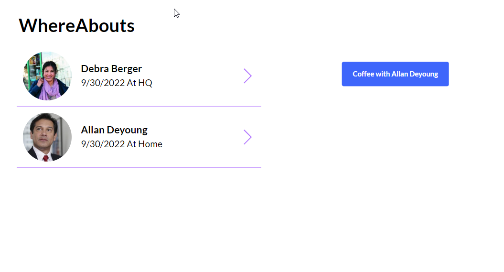

# App to App Communication
Architectural example of an App to App communication pattern
:::note
This pages is under construction
:::
## Use case
:::info 
As a good colleague, I like to be able to easily setup a coffee meeting with peers in order to retain a good social relationship.
:::

import { Mermaid } from 'mdx-mermaid/Mermaid';
import BoxWithShadow from '@site/src/components/BoxWithShadow'

## Architecture
### Assumptions

You find your peers in a Lists. Each peer report their whereabouts in another List. The handling of WhereAbouts is not covered here.

Coffee orders will be stored in a list.
### Data model
<BoxWithShadow caption="Datamodel">

<Mermaid chart={`
erDiagram
    Peers ||--o{ WhereAbout : userId
    WhereAbout {
        userId string
        available date 
    }
    User ||--o{ Peers : "Relates to"
    User ||--o{ CoffeeOrder : Order
    CoffeeOrder{
        when    date
        quantity    number
    } 
    
            
`} />

</BoxWithShadow>

### Application Flow

<BoxWithShadow>


<Mermaid chart={`
sequenceDiagram
    autonumber
    actor You
    participant Peers
    participant Coffee
    participant Office365
    participant Lists
    You->>Peers: Start app
    Office365->>Peers: User
    note over Peers: When you start the Peers app you are automatically signed in
    You->>Peers: Look for Johns whereabout
    Peers->>+Lists: John at work today?
    Lists->>+Peers: Yes he is!
    You->>Peers: Order coffee
    Peers->>+You: Redirected to Coffee App
    Office365->>Coffee: User
    Peers->>Coffee: Peer John
    note over Coffee: App knows who you are and that you like to drink coffee with John
    Coffee->>+Lists: Order stored
    note over Coffee: Order have been made and can be picked up by a an app or a service
    
`} />
</BoxWithShadow>

#### Steps

1. You launch the app
2. You are automatically signed in
3. You look for Johns whereabout
4. List is query
5. Assuming John is where you will be
6. You start coffee order process
7. You are automatically redirected to the Buy Coffee app
8. You are automatically signed in (again)
9. Your peer is read from the Param function
10. Order is posted

## My Peers application
The peer application gives you easy access to the whereabouts of your peers. 

So when you find a peer, you have the option for inviting for a cup of coffee.

Ordering coffee is done in Buy Coffee app
### Screen interactions
<BoxWithShadow>


<Mermaid chart={`
sequenceDiagram
    autonumber
    actor You
    participant OrderCoffeeButton
    participant Gallery
    participant Collection
    participant GlobalVariables
    participant List
    List->>Collection: Load your peers availibilty
    Collection->>Gallery: Show peers
    You->>Gallery: Select peer
    You->>OrderCoffeeButton: Order Coffee
    note over GlobalVariables: Assume that a global variable has been set with the URL of the Coffee App
    GlobalVariables->>OrderCoffeeButton: Get URL of Coffee App (COFFEEAPP)
    Gallery->>OrderCoffeeButton: Get selected peer
    note over  OrderCoffeeButton: Control is now send to a new app 
    
`} />

</BoxWithShadow>

### Mockup

<BoxWithShadow>



</BoxWithShadow>


When You click on the Order Coffee Button

```test title="OrderCoffeButton.OnSelect"
Navigate(COFFEEAPP & "?peer=" & Gallert.SelectedItem.userId)
```

## Buy Coffee application

The Buy Coffee application gives you easy access to get a cup of coffee and support handling multiple coffee orders.

### Screen interactions

### Mockup