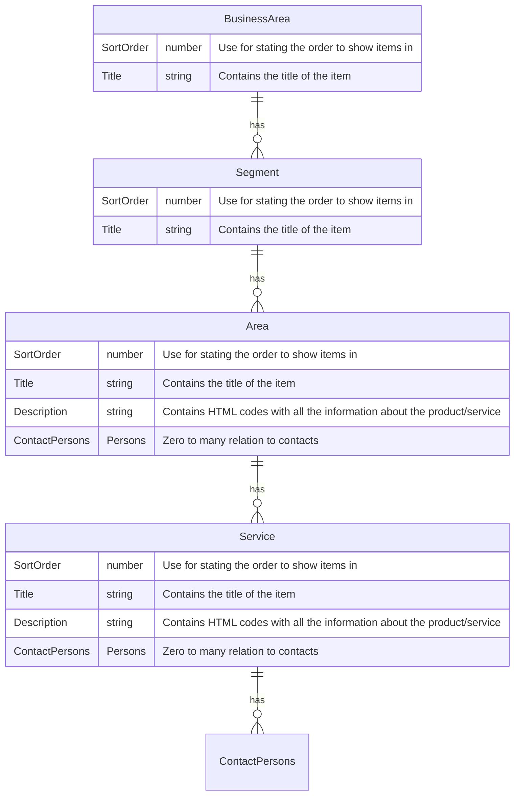
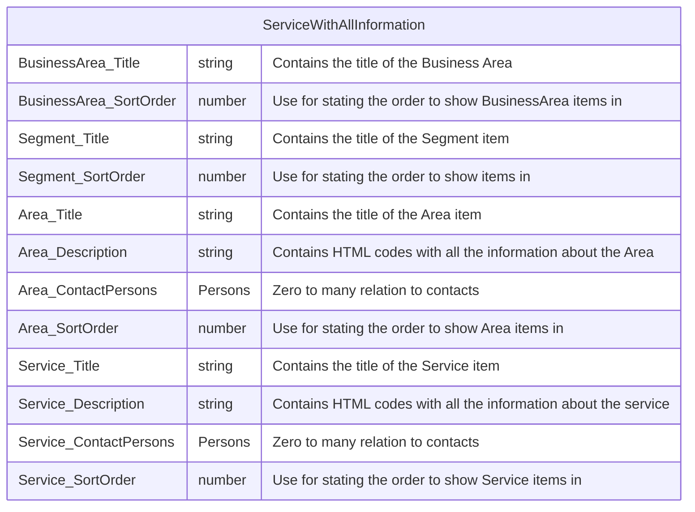

# Design Pattern 

## Model View Control

### Introduction
Model View Control is a design pattern which make your code more maintainable and easier to understand. It is a pattern which is used in many different programming languages and frameworks.

### The Problem
When you create a PowerApp you will typically create a screen which contains a lot of controls. The controls are typically connected to a data source. The data source can be a SharePoint list, a Dataverse table or a SQL database. The data source can also be a collection which is created in the PowerApp. The problem with this approach is that the code is not very maintainable and it is hard to understand what the code does.

### The Solution
The solution is to create a model which contains the data which is used by the screen. The model is typically created in a separate  process, e.g. on screen load. The model is then connected to the screen. 

## How can you do that in PowerApps ?

### Create a Model
In order to maintain data efficiently you need to create a relational model.

### Hierarchy 



### Model
We pull out the facts based on a logical model which can be made in Power FX with code like this

```javascript

Clear(AreaAndSegments);
Clear(AreaAndSegmentsAndServices);
ForAll(
    'Areas',
    Collect(
        AreaAndSegments,
        // TODO _ read all data
        {
            AreaID: ID,
            AreaName:Title,
            AreaDescription:Description,
            AreaContactPersons:'Contact Person',
            SegmentName: Segment.Value,
            SegmentSortOrder: LookUp(
                Segments,
                ID = Segment.Id
            ).'Sort Order',
             BusinessAreaName: LookUp(
                'Segments',
                ID = Segment.Id
            ).'BusinessArea'.Value
        }
    )
);


ForAll(
    'Services',
    Collect(
        AreaAndSegmentsAndServices,
        
        {
            AreaID: Area.Id,
            ServiceTitle:Title,
            ServiceDescription:Description,
            ServiceContactPersons:'Contact Person',
            ServiceSortOrder:'Sort Order',
            AreaName:LookUp(AreaAndSegments,AreaID=Area.Id).AreaName,
            AreaDescription:LookUp(AreaAndSegments,AreaID=Area.Id).AreaDescription,
            AreaContactPersons:LookUp(AreaAndSegments,AreaID=Area.Id).AreaContactPersons,
            SegmentName:LookUp(AreaAndSegments,AreaID=Area.Id).SegmentName,
            SegmentSortOrder:LookUp(AreaAndSegments,AreaID=Area.Id).SegmentSortOrder,
            BusinessAreaName:LookUp(AreaAndSegments,AreaID=Area.Id).BusinessAreaName
            
        }
    )
);


```

Fact "Virtual List"



