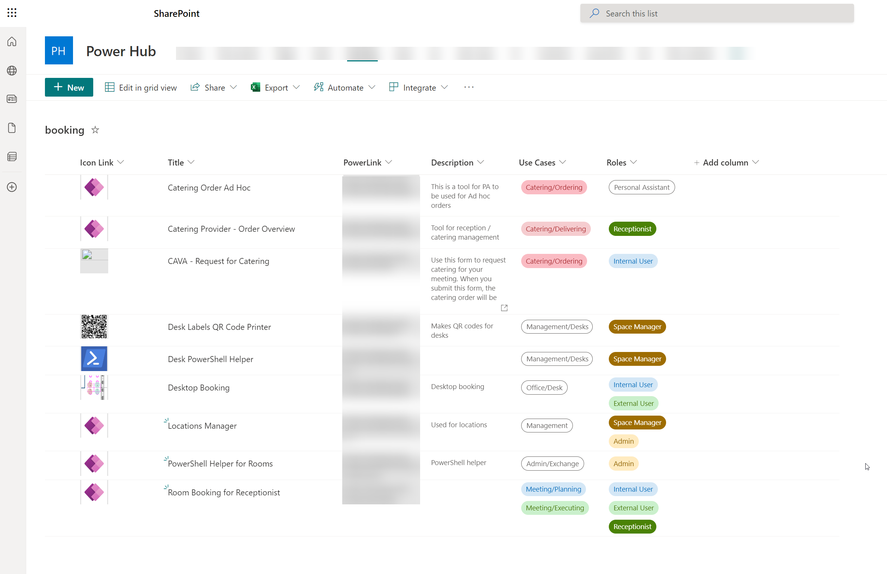

# Booking Case

## Introduction
In order to support the booking experience of the company which I worked for I together with a colleague created a portfolio of PowerApps combined with React Single Page Apps and rest API's

## The Problem
The company had a booking system which was based on a legacy system. The system was not very user friendly and the user experience was not great. The system was also not very flexible and it was hard to add new features.

## The Solution
The solution was to create a new booking system which was based on PowerApps and React. The new system was based on a set of PowerApps which was connected to a set of React Single Page Apps. The PowerApps was used to create the booking experience and the React Single Page Apps was used to create the admin experience. The React Single Page Apps was also used to create a set of API's which was used by the PowerApps to create the booking experience.

## The Result
The result was a booking system which was very user friendly and which was very flexible. The system was also very easy to maintain and it was easy to add new features.
