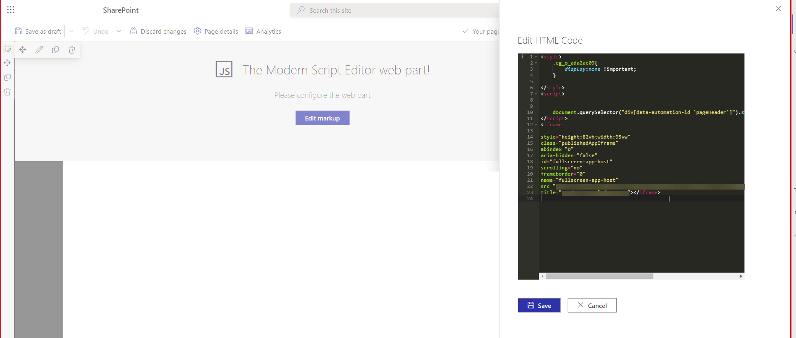

# Full width iframe



To make a full with iframe in SharePoint Online you need to add the following code to the HTML of the page:

```html
<style>
    .eg_o_ada2ac09{
        display:none !important;
    }
    
</style>
<script>

    
    document.querySelector("div[data-automation-id='pageHeader']").style.display="none"
</script>
<iframe 

style="height:82vh;width:95vw" 
class="publishedAppIframe" 
abindex="0" 
aria-hidden="false" 
id="fullscreen-app-host" 
scrolling="no" 
frameborder="0" 
name="fullscreen-app-host" 
src="https://apps.powerapps.com/play/" 
title="Title"></iframe>

```