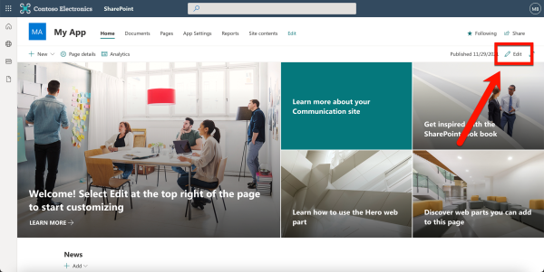
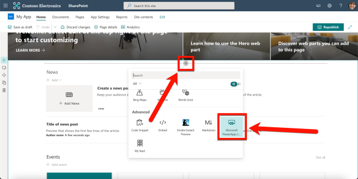
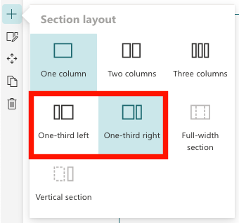

# Publish to a SharePoint page

Once you've published a Power App, you need to share it with your users! Add an app right to a SharePoint page for easy access in your intranet or team site so people can get to it right where they already hang out. Here's how to do it.


## SharePoint > Power Apps
If you've published a Power App for your users, you'll want to let them know that the app is available to start using. The app might be informational and there for them to access it at their convenience or it might align with a call to action to ensure everyone is submitting important information by a deadline. A great way to get your app in front of them is to add the published app to a SharePoint page.

This post assumes your app is already published and you have a modern SharePoint site available to add the app to. If the app is high visibility (e.g., time off request, travel reimbursement submission), you likely want to add this app to a communication site in your intranet. If you're not familiar with your intranet setup, reach out to your internal IT team for guidance. If this app is for a smaller team or working group, adding the app to a page in a team site is reasonable.


Either way, make sure your app is shared with the right audience. The important thing to note is you should provide the same access to the app that the SharePoint site has. If someone with access to the site—but not the app—visits the site, they will see an error message in the space where the app would be. Avoid that entirely by using security groups to provide access to both the app and the site.

Add a Power App to a SharePoint page
1. In SharePoint, open the page where you want to add the Power App.

2. In the top-right corner, click Edit.
   


3. Click the plus sign (+) that displays in a section to open the Web part menu. Click Microsoft Power Apps in the menu. You can also filter the web part options by typing “power” in the search box.



4. In a new tab, open the Power Apps home page and click Apps then click ⋯ next to the app name and select Details.


5. Under Web link, highlight and copy the URL (right-click > Copy or Ctrl/Command+C).

6. Jump back to your SharePoint tab. In the Power Apps web part pane on the right side, paste the URL (right-click > Paste or Ctrl/Command+V) in the Web app link or ID field.


7. You can add a thin border around the app by enabling the Show border option to On.

8. Your changes are saved automatically, but to make them visible to others, click either Save as draft (visible only to site owners and members) or Publish/Republish (visible to anyone with access to the site.)


Your app is now published and accessible on this site. Keep permissions in mind: the site’s permissions may be different from the app’s permissions. Adding an app to a SharePoint page does not change the permissions of the app.


## Optimizing the experience
You can continue to manage and update your app from the Power Apps portal. Each time someone loads the SharePoint page, the most recently published version of the app will display.


One thing you may want to consider on your page is including some context or instructions next to or near the app. We especially like the section layouts called one-third left and one-third right for this situation.




You can use the one-third section to include instructions, context, and other web parts like calls to action or buttons and the two-third section for the app. Adding the app to a high-visibility page—like your intranet homepage—will ensure people see the tool or respond to the request to submit because they won't miss it!


## Making it full width

:::warning Requires admin

This will require you to engage with your IT Guys and ask them to support you in getting the [Script editor web part for modern pages built in React](https://github.com/pnp/sp-dev-fx-webparts/tree/main/samples/react-script-editor)

:::


```html HTML code to insert
<script>
// In this case we liked to have the standard Page Header hidden
   document.querySelector("div[data-automation-id='pageHeader']").style.display="none"
</script>

<iframe style="height:82vh;width:95vw" 
class="publishedAppIframe" 
tabindex="0" 
aria-hidden="false" 
id="fullscreen-app-host" 
scrolling="no" 
frameborder="0" 
name="fullscreen-app-host" 
src="https://apps.powerapps.com/play/YOURPOWERAPPID?tenantId=YOURTENANTID" 
title="YOUR APP TITLE"></iframe>

```