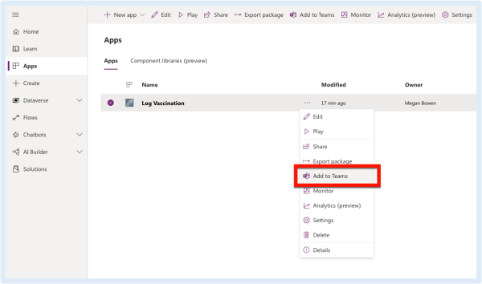
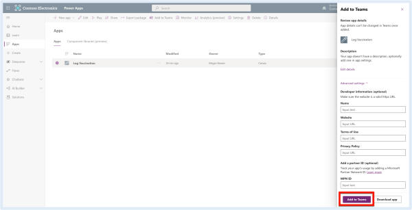
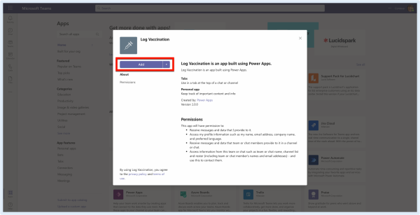
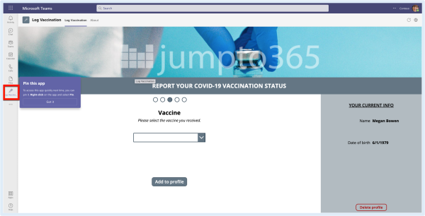
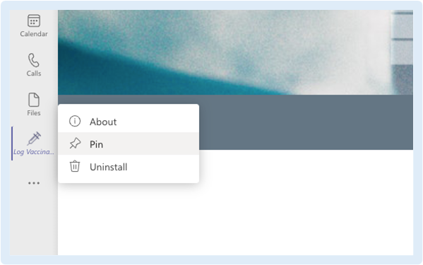

# Add PowerApps to Teams
Microsoft Teams <3 Power Apps
If you've published a Power App for your users, you'll want to let them know that the app is available to start using. The app might be informational and there for them to access it at their convenience or it might align with a call to action to ensure everyone is submitting important information by a deadline. A great way to get your app in front of them is to add the published app to the Microsoft Teams app store. From there, your audience can install the app to Teams and add it to their app bar or as tabs in their Team's channels.

This post assumes your app is already published and is shared with the right audience. Adding the app to the Teams app store does not change the permissions of the app.

## Publish a Power App to the Teams app store
1. From the Power Apps portal, click Apps in the app bar.

2. To the right of your app name, click the ⋯ menu then select Add to Teams.

3. In the Add to Teams pane, click Add to Teams.
Note: you may want to first click Edit details to add a short description, so your users know what‘s expected when using this app. You can also expand Advanced settings to add further information. For example, you can include a link to instructions if you‘d like.

4. Power Apps will open Teams. Your browser may request access to open in the desktop app. If you prefer that, allow it. If not, click Cancel then click Use the web app instead. The screenshot below shows what happens in Google Chrome on macOS, but it‘s a similar experience regardless of the browser or operating system.

5. Once Teams opens to the app details page, click Add.

6. The app opens from the Teams app bar.

7. Right-click the app icon to pin it to stay.

8. Want to add the app as a tab in a Team? Follow these instructions.