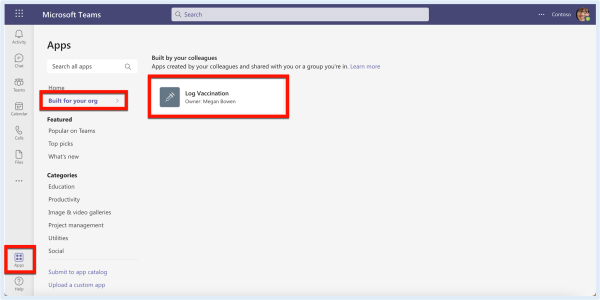
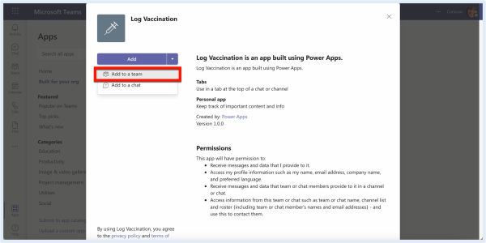
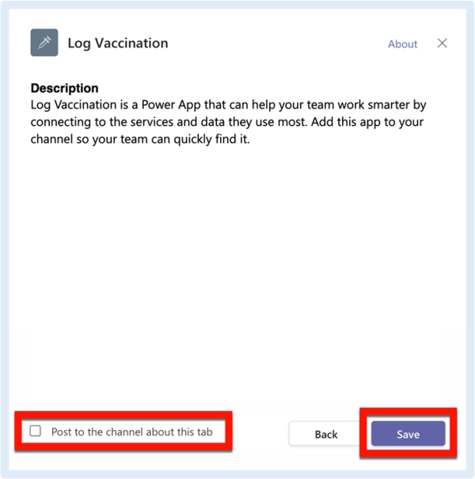
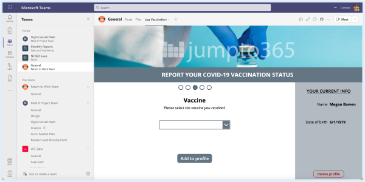
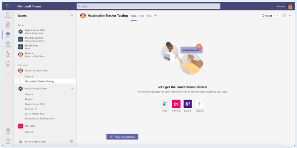
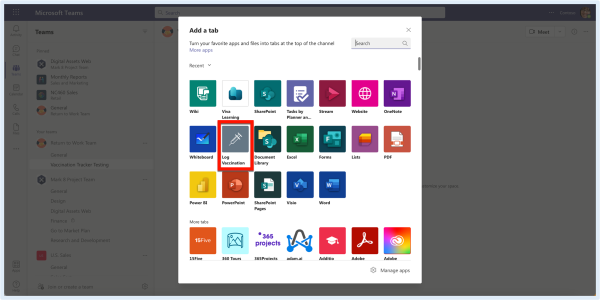
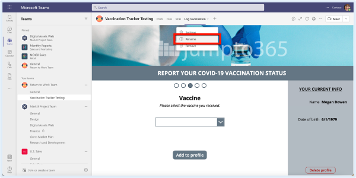

# Add as a Tab
Bringing a Power App into your channels

Once a Power App is published to the Teams app store (how do I do that?), anyone with access to the app can add it as a tab in channels in their Teams. This is useful if your app is something they need to access regularly, in context within a Team they use. It could be a local app or form that people have to fill out in a small Team to submit incoming requests (like a ticketing tool) or it could be an app that everyone uses to manage day-to-day work (like a time off request form). For the former, a small Teams of a few to a few dozen can benefit and for the latter, an owner of an org-wide Team can add a tab to a high-value app or form. There are a lot of options here and providing easy access to an app or form that's used regularly is a benefit Teams can provide thanks to tabs in channels.

To add a Power App as a tab in a Team, you have to install the app in the Team first. You'll have to do this for each Team you want to install the app to. Once the app has been installed in the Team, you can add the app as a tab in any channel in that Team. To add the app as a tab in multiple channels across multiple Teams, you have to install the app in each of the Teams first.

## Install the app in your Team
1. Open the Teams App Store by launching Teams then clicking Apps in the app bar. It doesn't matter whether you use the Teams desktop app or browser app. You likely wont' be able to do this on a mobile device (but maybe!).

2. In the App Store, click Built for your org then click your app‘s name. (Once a Power App is made available to someone and published to the Teams app store, they will automatically see it as an option in the Built for your org section of the Teams app store.)

3. Next to the Add button, click the menu triangle then select Add to a team.

4. Teams will prompt you to add it directly to a channel. Type in the Team or channel name and select it from the listed suggestions. When finished, click Set up tab.

5. On the app pane that comes up, uncheck the box next to Post to the channel about this tab if you don‘t want a notification sent yet, then click Save.

Add the app as a tab in other channels in that Team
6. Your app is now available as a tab in that channel. To add the app as a tab in another Team, follow the steps above again. To add your app as a tab in another channel in the same Team, continue to the next step.

7. The app is now available to add as a tab in any other channel in that Team. To add the app to another channel in that Team, open the channel.

8. At the top of the Posts window, click the plus sign (+) to the right of the row of tabs.

9. In the Add a tab pane, select the app. If you don‘t see it, use the search box. If you still don‘t see it, the app was not successfully added to your Team and you need to follow the earlier steps again.

10. On the app pane that comes up, uncheck the box next to Post to the channel about this tab if you don‘t want a notification sent yet, then click Save.

11. Your app is now a tab in your channel.

12. Change the tab name at any time by clicking the menu arrow, then click Rename and follow the prompts.

## A few tips
- Keep your tab name concise but obvious. In this example, we're adding an app for someone to submit their Covid-19 vaccination status. "Log Vaccine" is the name we went with because it's short, actionable, and reasonably obvious to the audience what the tab is for. Long tab names are easy to miss and descriptors aren't as useful as action terms. The default tab name is always the app's published name in Power Apps, so if you're the app owner and you don't want your audience to have to worry about this when creating these tabs, be strategic about how your app is named and remember the context. You're working for the users, not the other way around.

- The Post to the channel about this tab option is annoying. If you want people to know about a new tab, don't rely on Teams to post a contextless message in the channel. Instead, post your own message (be sure to use [a subject line!](https://support.microsoft.com/en-us/office/create-and-format-a-post-e66777da-636b-49eb-9408-b0d88b212885)) that gives everyone an overview of what the tab is and how it can be used. Give some context and even @mention people if you want to make sure they see the notification. Automated system messages are easy to ignore; messages from actual humans are much more likely to be read.
  
- You can't add a Power App as a tab in a private chat, only Teams channels. This is one of the many, many reasons why Teams channels are a much better way to communicate than private chat.