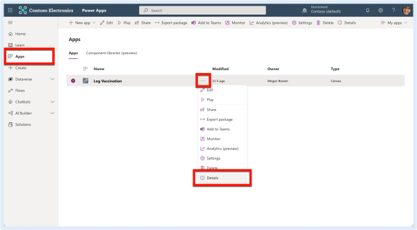
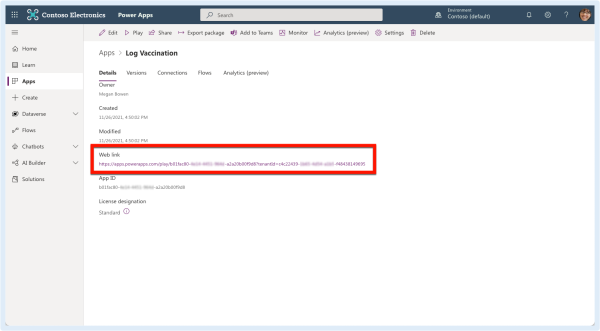
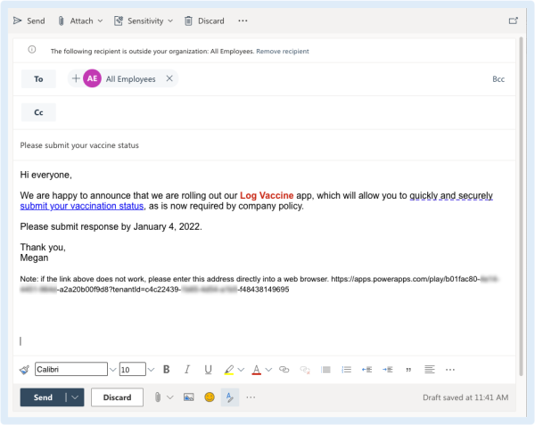

# Share a link
Once you've published a Power App, you need to share it with your users! Sending a link in an email or other medium remains one of the most popular. Here's how to do it.

## Linking to your app
If you've published a Power App for your users, you'll want to let them know that the app is available to start using. The app might be informational and there for them to access it at their convenience or it might align with a call to action to ensure everyone is submitting important information by a deadline. While there are more integrated ways to share Power Apps (e.g., through Microsoft Teams), sometimes a link from an email or communication remains the simplest option. A call to action in an email, Yammer post, or video training description can meet that need, but you‘ll require a web address to point your readers to.

## Getting the app link
Keep in mind the link to the Power App is just that: a link. You can link from any medium, including a personal email message, text message, or any other messaging tool, even a closed Facebook group. The point is: the recipient must have the app shared with them to access. The link itself can be shared widely without worry of abuse since it’s accessible only to internal people who need to log in and authenticate. (This means anyone hoping to use this app must have a Microsoft 365 account with Power Apps access enabled—external access to individuals without Microsoft 365accounts is not possible.)

1. From the Power Apps home page, click Apps then click ⋯ next to the app name and select Details.

2. Under Web link, highlight and copy the URL (right-click > Copy or Ctrl/Command+C).

3. In your communication method of choice, paste the URL so your audience can click it and access (right-click > Paste or Ctrl/Command+V). Always try to format an action statement as the hyperlink by highlighting the message and pressing Ctrl/Command+K. The example email below shows both action text and a back-up at the end displaying the full URL, just in case the first one doesn‘t work correctly (best practice for sharing important URLs in email).

## Some things to think about when linking to a Power App
The link to a Power App can be long and ugly. You may want to use a link shortener to make the link more palatable or even customized to something like org.co/applink. Bit.ly is the best-known tool for the job, but tinyurl.com works in a pinch as well.

This app link can be accessed both on desktop (via a browser) and mobile devices. For the best experience, your users should install the Power Apps mobile app from their respective mobile app store and log in before accessing any apps on their mobile device. If you use InTune andCompPortal to control apps that can be installed on organization phones or tablets, you need to approve the Power Apps app for your users to install. If this is the first Power App that many recipients will experience, you should include instructions in your message to install the Power Apps mobile app if mobile access is something users will expect (they likely will).