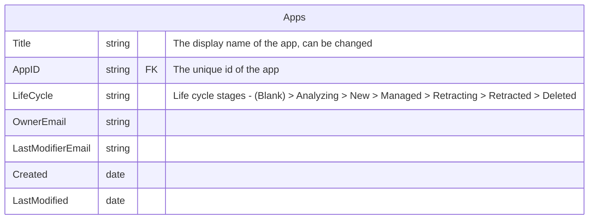

# Power DNS
Which app do we have, who owns them, who can maintain them, what level of support can I expect?

:::note
This pages is under construction
:::

Start really simple, e.g. by making a List containing PowerApps which can be used, who owns the app and who could be the editors of that.


## List of PowerApps
### List model


### Read list data from PowerShell

```powershell
. "$PSScriptRoot/load.ps1"
. "$PSScriptRoot/.intra365.ps1"


# Provide Site URL and List name
$SiteURL = $env:I365_APP_SHAREPOINTLIST ##  "https://christianiabpos.sharepoint.com/sites/powerapps"
$ListName = "Apps"
  
Try {
# Connect to PnP Online
Connect-PnPOnline -Url $SiteURL -Interactive

# Setup hash
$hash = @{}

# Get List Items
$ListItems= (Get-PnPListItem -List $ListName -Fields "Title","GUID","Life Cycle")  
ForEach($ListItem in $ListItems)
{ 
    $key = "$($ListItem["GUID"])"
    $value = @{
        Title=$ListItem["Title"]
        LifeCycle=$ListItem["Life Cycle"]
    } 
    $hash.Add($key,$value)

}  
 
}
catch {
Write-host "Error occured: $_" -f Red
}


```

## Process
### Get the Insight

PowerApp catalogue

import { Mermaid } from 'mdx-mermaid/Mermaid';

<Mermaid chart={`
sequenceDiagram
    autonumber
    actor AppOwner
    actor PowerTeam
    participant PowerApps
    participant Docs
    participant Lists
    AppOwner->>PowerApps: Creates an App
    PowerApps->>PowerTeam : List all Apps
    PowerTeam->>Lists : Store life cycle of app
    PowerTeam->>Docs : Store documentation  
`} />