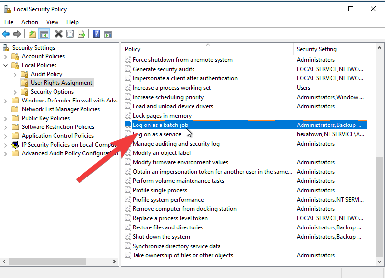
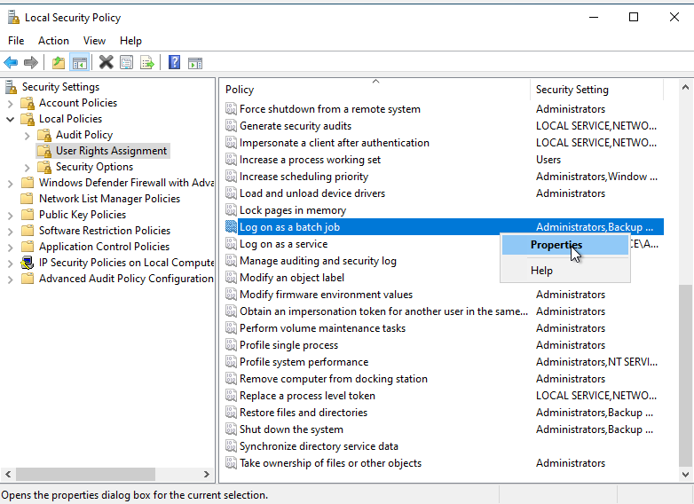
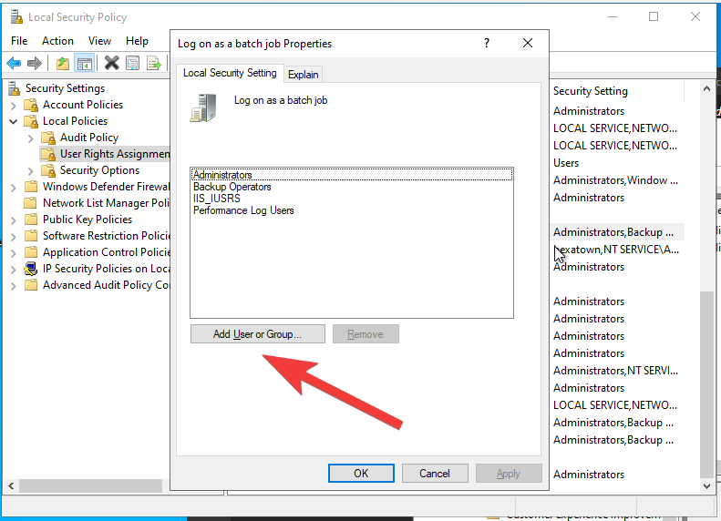
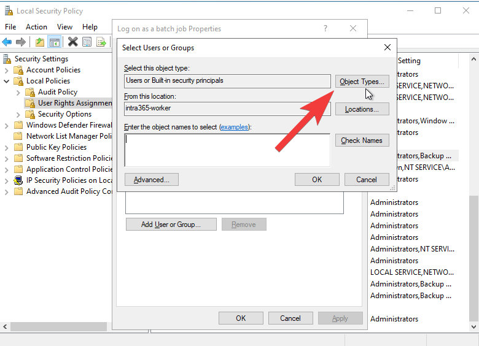
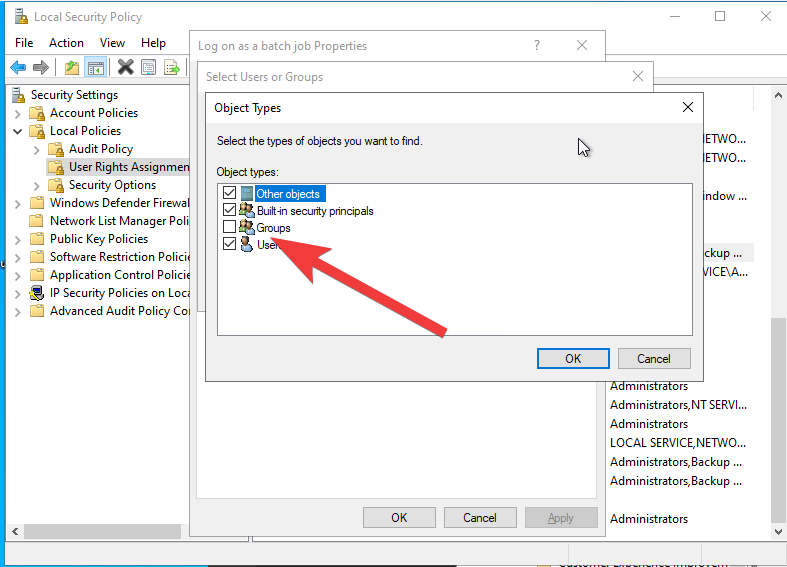
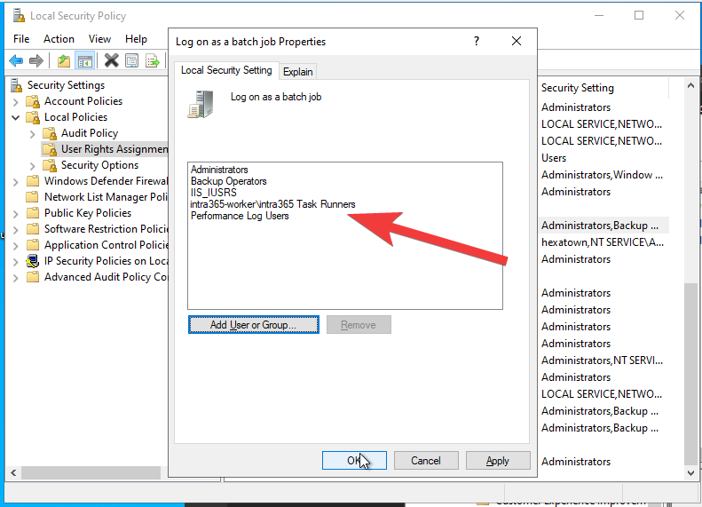
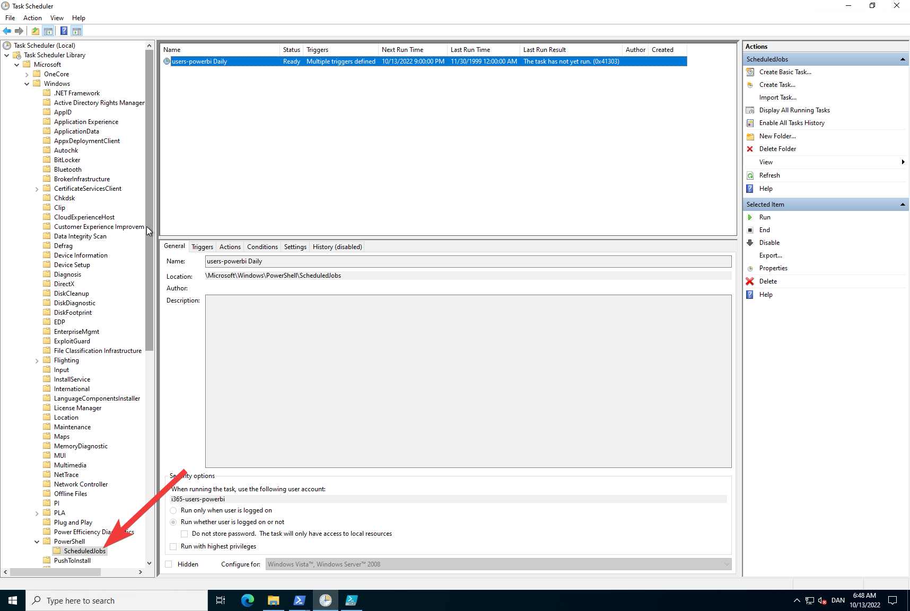

# Jobs (Windows Server)

## Setup
## Initial server setup
Create a folder `c:\jobs` and add a file `c:\jobs\setup.ps1` with the following content


```powershell title="/jobs/setup.ps1"
If (!(test-path (join-path $PSScriptRoot  "NTFSSecurity"))) {
    Save-Module -Name NTFSSecurity   -Path $PSScriptRoot 
}
Import-Module -Name (join-path $PSScriptRoot  "NTFSSecurity") -DisableNameChecking -Force
    

$isAdmin = ([Security.Principal.WindowsPrincipal] [Security.Principal.WindowsIdentity]::GetCurrent()).IsInRole([Security.Principal.WindowsBuiltInRole]::Administrator)
$fileToRun = "$PSScriptRoot\setup.ps1"

if (!$isAdmin){
    write-host "Starting PowerShell in admin mode"
    Start-Sleep 2
    $arguments = "-NoExit -file ""$fileToRun `$force `$setupApp `$setupSharePoint"" "
    Start-Process powershell -Verb runas -ArgumentList $arguments
    exit 
}


$taskRunnerGroupName  =  "Intra365 Task Runners"
$taskRunnerGroup = (Get-LocalGroup | where {$_.Name -eq $taskRunnerGroupName} )
write-host "Checking Group $taskRunnerGroup "
if ($null -eq $taskRunnerGroup){
    write-host "Creating Group"
    New-LocalGroup -Name $taskRunnerGroupName
}


write-host "Granting Read and Execute permission on c:\code"
Add-NTFSAccess -Path "c:\code" -Account $taskRunnerGroupName -AccessRights ReadAndExecute


```

### Grant Logon as a batch job 
:::info 
This is a one-off, so I will not create a script for it.

Found this script which shows you have it can be done in PowerShell https://github.com/zloeber/Powershell/blob/master/Supplemental/Add-UserToLoginAsBatch.ps1
:::

Open `Local Security Policy` (Start -> Run -> `secpol.msc`)

Select `Local Policies` -> `User Rights Assignment` -> `Log on as a batch job`



Right click and select `Properties` 



Select `Add User or Group` 



Select `Object Types` 



Check `Groups` and select `OK`




Add the group `Intra365 Task Runners` and select `OK`



Verify that the group is added, and select `OK`

## Setup a job
### Give the job a short name

For each job, create a folder in `c:\jobs` with a short name. For example `c:\jobs\myjob`

### Create the package file
Create a file called `package.json` in the job folder with the following content

```json title="/jobs/myjob/package.json"
{
    "name": "myjob",
    "version": "1.0.0",
    "description": "My job",
    "main": "index.js",
    "scripts": {
        "start": "node index.js"
    },
    "author": "Intra365",
    "license": "ISC",
    "dependencies": {
        "node-schedule": "^2.0.0"
    }
}
```

### Create the setup file

Add a file `c:\jobs\jobname\setup.ps1` with the following content. 
```powershell title="/jobs/jobname/setup.ps1"
If (!(test-path (join-path $PSScriptRoot  "NTFSSecurity"))) {
    Save-Module -Name NTFSSecurity   -Path $PSScriptRoot 
}
Import-Module -Name (join-path $PSScriptRoot  "NTFSSecurity") -DisableNameChecking -Force
    

$isAdmin = ([Security.Principal.WindowsPrincipal] [Security.Principal.WindowsIdentity]::GetCurrent()).IsInRole([Security.Principal.WindowsBuiltInRole]::Administrator)
$fileToRun = "$PSScriptRoot\setup.ps1"

if (!$isAdmin){
    write-host "Starting PowerShell in admin mode"
    Start-Sleep 2
    $arguments = "-NoExit -file ""$fileToRun `$force `$setupApp `$setupSharePoint"" "
    Start-Process powershell -Verb runas -ArgumentList $arguments
    exit 
}


$package = (Get-Content (join-path $PSScriptRoot "package.json") -raw) | ConvertFrom-Json

$username =  "i365-$($package.name)"
$passwordInText = "i365@packages!"
$jobName = "$($package.name)"


function RegisterJob($jobname,$scriptname,$credential,$startAt,$repetitionInterval)
{
    write-host "RegisterJob '$jobname'   " 
    $job = Get-ScheduledJob | where {$_.name -eq $jobname}
    if ($null -ne $job){
        Write-Host "Job  already registered"
        return
    } 
    

    $trigger1 = New-JobTrigger -Once -At $startAt -RepetitionInterval $repetitionInterval -RepeatIndefinitely 
    $trigger2 = New-JobTrigger -AtStartup -RandomDelay (New-TimeSpan -Minutes 5)
    Register-ScheduledJob -Name $jobname -ArgumentList $psscriptroot,$scriptname  -Trigger $trigger1 ,$trigger2   -ScriptBlock {
        param($psscriptroot,$scriptname)
        . "$psscriptroot\$scriptname.ps1"
    } -Credential $credential | out-null

}


$password = ConvertTo-SecureString $passwordInText  -AsPlainText -Force
$taskRunnerGroupName  =  "Intra365 Task Runners"

if ($username.length -ge 20){
    $username = $username.Substring(0,20)
}


$taskRunnerGroup = (Get-LocalGroup | where {$_.Name -eq $taskRunnerGroupName} )
write-host "Checking Group $taskRunnerGroup "
if ($null -eq $taskRunnerGroup){
    write-host "Creating Group"
    New-LocalGroup -Name $taskRunnerGroupName
}

write-host "Checking User $taskRunnerUser   "
$taskRunnerUser  = Get-LocalUser | where  {$_.Name -eq $username }
if ($null -eq $taskRunnerUser){
    write-host "Creating User"
    $taskRunnerUser    = New-LocalUser -Name $username -Description "Account used for running tasks"  -PasswordNeverExpires:$true -AccountNeverExpires -UserMayNotChangePassword  -Password $password
    Add-LocalGroupMember -Group  $taskRunnerGroupName  -Member $username
} 

$credential = New-Object -TypeName System.Management.Automation.PSCredential -ArgumentList $username, $password

RegisterJob "$jobName Daily" "every-day" $credential "21:00" (New-TimeSpan -Days 1) 
#RegisterJob "$jobName Hourly" "every-hour" $credential "00:30" (New-TimeSpan -Hour 1) 
#RegisterJob "$jobName Minutly" "every-minute" $credential "00:00" (New-TimeSpan -Minute 1)


$dataroot = $psscriptroot

write-host "Reading permission on $dataroot "
$Acl = get-NTFSAccess -Path $dataroot

#"$acl | fl
#exit
write-host "Granting Full Control permission on $dataroot "
Add-NTFSAccess -Path $dataroot -Account $username -AccessRights FullControl

#write-host "Granting Read and Execute permission on c:\code"
#Add-NTFSAccess -Path "c:\code" -Account $username -AccessRights ReadAndExecute

```
## Monitoring jobs
### Has the job executed?
From the start menu open the Task Scheduler. You should see a folder called `Task Scheduler Library`. Navigate to  `Task Scheduler Library/Microsoft/PowerShell/ScheduledJobs` That folder contains all the jobs that are registered from PowerShell using the [Register-ScheduledJob](https://learn.microsoft.com/en-us/powershell/module/psscheduledjob/register-scheduledjob?view=powershell-5.1) command.




### Log details
tbd

https://appuals.com/task-scheduler-failed-to-start-error-value-2147943785/#:~:text=Additional%20Data%3A%20Error%20Value%3A%202147943785%E2%80%9D.&text=Therefore%2C%20we%20investigated%20it%20and,require%20performing%20complex%20troubleshooting%20steps.

## Edit local user on Windows Server

Navigate to `Computer Management` and select `Local Users and Groups` and then `Users`. Right click on the user and select `Properties`.


