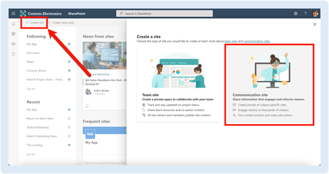
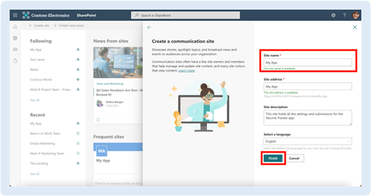

# Create a site from the SharePoint start page
:::note
This pages is under construction
:::

## Open the Office Hub.
Navigate to https://office.com,  also known as the Office 365 homepage or the Office Hub. Sign in if requested. You can also use the Office app on Windows to perform this and the following steps in this section. 

:::info
If you use Microsoft 365 in Germany, China, or a US Government GCC, GCC High, or GCC DoD cloud, your link will be different. Contact your IT team for the link if you don’t know it.
  You can download the Office app for Windows here: https://jum.to/3sDIhDr.

:::
## App Launcher

Open the App Launcher by clicking the Waffle ( ) in the top-left corner of the page.

 
## SharePoint start page
Open the SharePoint start page by clicking   SharePoint. 
 
 
## Create a new site.
Click **Create site**.  In the New site pane, select Communication site, though you can choose Team site if you prefer.

 
 
## Name your site.
In this example, we named our site My App. You can name your site however you’d like. Perhaps something like **Covid-19 Vaccination Reporting Site**.

Note that you can always rename the site later, but do not change the site address after completing this Recipe. Changing the site address will break relations and links in the finished app; if it is important enough to change the site address, you will need to make other updates to the app and lists after publishing this app. 
 

## Complete the site’s metadata.
Enter a site description so everyone knows the role of the site. If your organization uses sensitivity labels, choose the appropriate label under Sensitivity. 
Click **Finish**.
 
## Your site has been created
Welcome to your new site! You have created the site and can skip through any other prompts SharePoint sends your way, unless you want to use them for anything.
 
The remaining steps in this Recipe can only be completed by an owner of this SharePoint site. Generally speaking, site members and visitors will lack the necessary permissions to complete this Recipe. You can add owners to your site at any time. 
 
